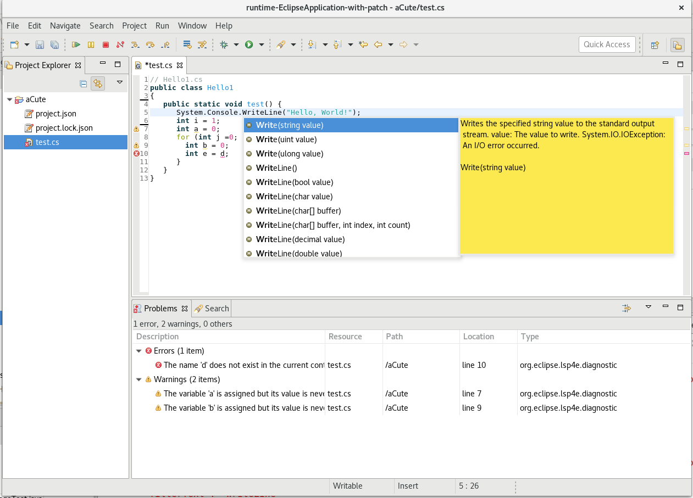

# aCute: C# in Eclipse IDE

Support for C# edition in Eclipse IDE. Relies on OmniSharp and Language Server Protocol.

## Prerequisites

* On **any OS**, `node` needs to be available in your PATH.
* On **Linux**, `mono-devel` needs to be installed. ([dotnet-core not supported by OmniSharp Language Server yet](https://github.com/OmniSharp/omnisharp-node-client/issues/398)).
* On **Windows**, .NET SDK needs to be installed.
* On **Mac**: ?

Or see [Alternative server setup](#Alternative-server-setup)

## Installation in Eclipse IDE

Using Eclipse Marketplace: https://marketplace.eclipse.org/content/acute-c-edition-eclipse-ide-experimental

Using p2 repository: use `http://repository.jboss.org/nexus/content/unzip/unzip/org/eclipse/acute/repository/0.1.0-SNAPSHOT/repository-0.1.0-SNAPSHOT.zip-unzip/` in the [Install New Software wizard](http://help.eclipse.org/topic/org.eclipse.platform.doc.user/tasks/tasks-127.htm)

## Concept

aCute uses the [lsp4e](https://projects.eclipse.org/projects/technology.lsp4e) project to integrate with [OmniSharp Language Server](https://github.com/OmniSharp/omnisharp-node-client) and [TM4E](https://projects.eclipse.org/projects/technology.tm4e) project to provide syntax highlighting in order to provide a rich C# editor in the Eclipse IDE.

## Alternative server setup

You can setup a local [OmniSharp Language Server](https://github.com/OmniSharp/omnisharp-node-client) fetched, configured and working locally. Then at least one of the following *environment variables* should be set to make Eclipse IDE able to locate your specific OmhiSharp-node-client:
* `OMNISHARP_LANGUAGE_SERVER_COMMAND`: a command-line to start omnisharp-node-client (such as `/usr/bin/node /home/mistria/git/omnisharp-node-client/languageserver/server.js`)
* `OMNISHARP_LANGUAGE_SERVER_LOCATION`: the location when omnisharp-node-client is installed (such as `/home/mistria/git/omnisharp-node-client`).

Note that this approach isn't recommended nor supported by the aCute project developers. It's mainly useful for contributors who want to hack things around Omnisharp-node-client and/or aCute.
